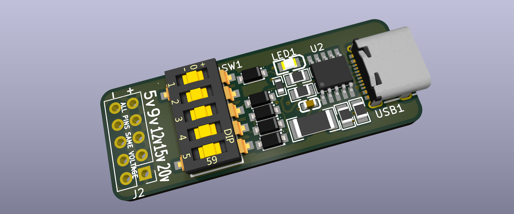
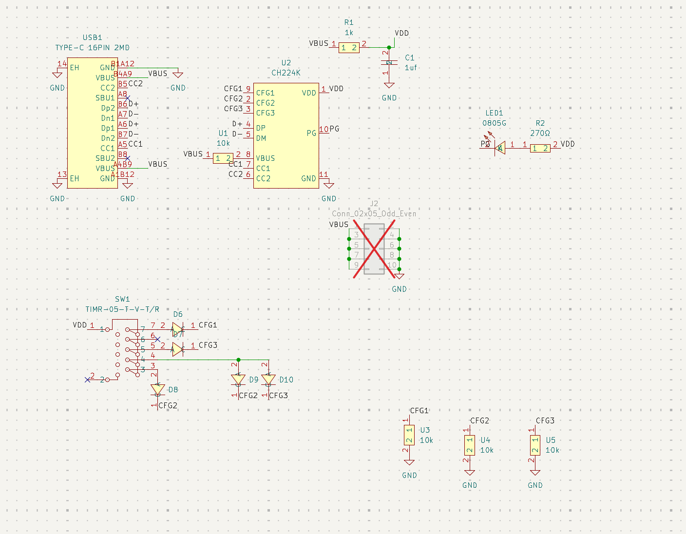
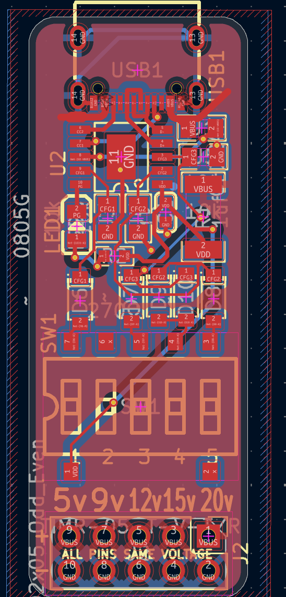

# peedee

## Note to the reviewers

See https://hackclub.slack.com/archives/C0AR9KH6BU2/p1784700225640219?thread_ts=1784646258.215889&cid=C0AR9KH6BU2

Fabrication BOM.csv located at [PCB/peedee/production_real/peedee_1_bom.csv](PCB/peedee/production_real/peedee_1_bom.csv)

USB-C power delivery board

## What this project is and why I made it

It's a USB-C power delivery board. It uses just a bare CH224k with no MCU or other ICs, but it also offers convenience through its user interface,  which allows users to select voltage levels without needing to look at a complex silkscreen lookup table. Instead, I used a diode-matrix ROM to convert one-hot encoded voltage selections into the proper signals for the three binary configuration lines. The schematic is deceptively simple-- I had to translate the datasheet and invent the diode ROM. One unexpected tricky part of this project was *resistor sorting*. This is because peedee, as per the reference schematic, **doesn't use an LDO**. Instead, it uses a 1k resistor and a decoupling cap 💀. Uniquely though, PD can draw medium-high voltages and currents, so the resistor has to be well-rated. Not only that, but it needs to be SMD, a relatively small footprint, and in stock on LCSC. This constrains my resistor choices from potentially tens of thousands of listings to just a few. Anyways, that was interesting.

I also like how it ended up in such a small footprint-- about the size of the top half of your pinky finger. Part density is especially high though because most of the footprints are bigger than 0402. I made it long and skinny, and in this way, it seems like a natural extension of the long and skinny USB cable that powers it.

## PCB Images

## Bom in table format

|Item    |Cost |
|--------|-----|
|PCB     |2    |
|PCBA    |32.56|
|Shipping|3.3  |
|Taxes   |3    |
|Total   |40.86|
